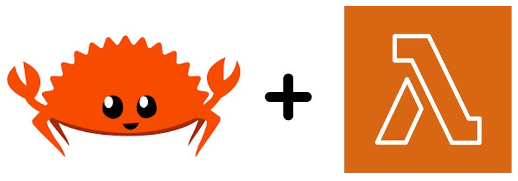

# Rust on Serverless



*A short disclaimer, I am learning in public with this repository. The samples may not represent best practices for the Rust language. If you spot anything that could be done better, please reach out and let me know.*

Historically, I've always worked with .NET, an object orientated language. This repo is my central place to challenge this object oriented view on the world and start working with a different language. All this learning is within the context of AWS Serverless technologies.

One of the original use cases for Rust is as an embedded systems programming language. Embedded systems are typically extremely resource contrained. When you consider the pricing and execution model of Lambda, it can also be considered a resource contrained language. Making Rust a perfect fit. That perfect performance fit can be seen in [these benchmarks](https://github.com/aws-samples/serverless-rust-demo).

## Samples

All the samples listed below use a combination of [cargo lambda](https://www.cargo-lambda.info/) and [AWS SAM](https://aws.amazon.com/serverless/sam/) to compile and deploy. If you want to deploy the examples into your own account, from the root of the sample directory, run `make build` and then `sam deploy --guided`. For example, if I wanted to deploy the 'HTTP Web Server on Lambda' example I would run:

``` bash
cd src/axum-lambda-web
make build
sam deploy --guided
```

### Simple Serverless API

[Link](./src/simple-serverless-api)

A simple API built with API Gateway and single purpose Lambda function handlers. This example also demonstrates how to unit test your serverless applications, using the `TestConnection` struct provided by the AWS CDK and using [Mockall](https://docs.rs/mockall/latest/mockall/).

### HTTP Web Server on Lambda

[Link](./src/axum-lambda-web)

An [Axum](https://github.com/tokio-rs/axum) web server running on AWS Lambda.

### Server Side Rendering on Lambda

[Link](./src/axum-lambda-web-server-side-rendering)

An [Axum](https://github.com/tokio-rs/axum) web server running on AWS Lambda. Server side rendering implemented using [Ructe](https://github.com/kaj/ructe).

This example also includes the use of a custom authorizer implemented at the API Gateway level. When deploying the stack, you can specify the password to use for the login page. Once deployed, navigate to the `/login` endpoint and use the specified password to login.

The login page generates and stores a session token in DynamoDB, with a TTL 5 minutes in the future. The custom authorizer checks DynamoDB to see if a valid token exists.

### Serverless ToDo API

[Link](./src/serverless-todo)

A fulley serverless ToDo API implemented with API Gateway, Lambda & DynamoDB. Demonstrates how to package multiple handlers in the same project.

This example also demonstrates how hexagaonal architecture practices and domain driven design can be applied to an application written in Rust.

### Step Functions Lambda

An order validation pipeline implemented using Step Functions & Rust. A look at how functional programming concepts can work with Rust & AWS Serverless technologies.

### SQS -> AWS Lambda

[Link](./src/sqs-sourced-lambda)

A Lambda function sourced by SQS.

## Additional Resources

- [Serverless Rust YouTube series](https://www.youtube.com/watch?v=i6FKvK5JQ8o&list=PLCOG9xkUD90KQ1IPQT_m1NbPRXXRFb63s)
- [Cargo Lambda CLI](https://www.cargo-lambda.info/)